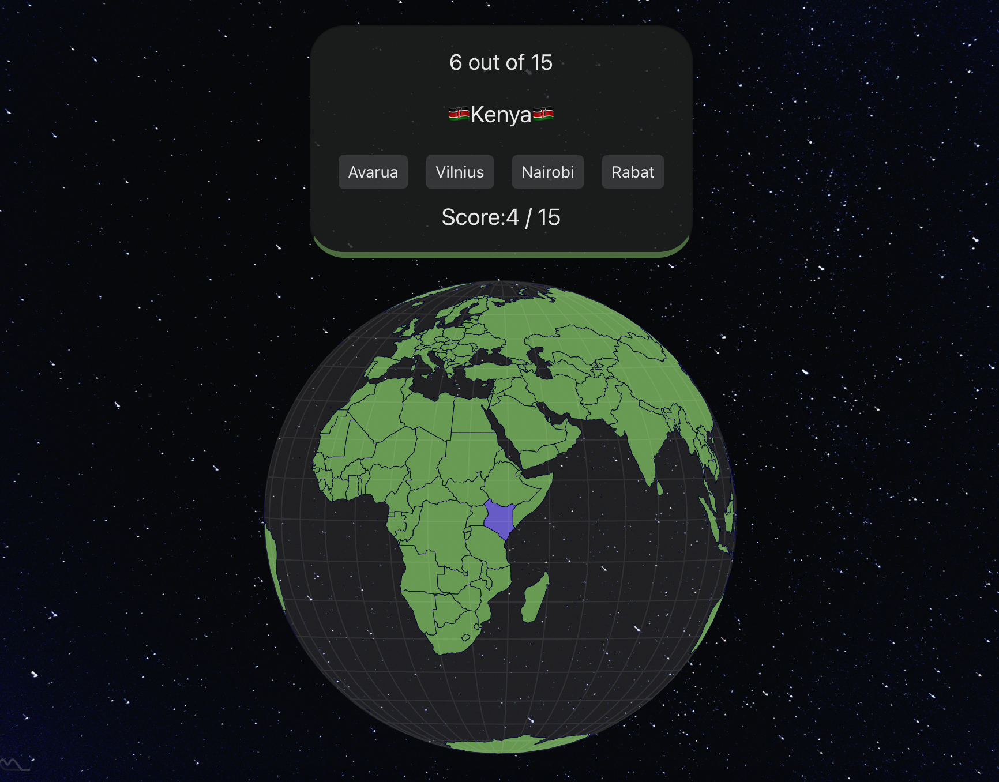

# GlobeTrotter Capitals Quiz

## Overview

This project is a capitals of countries and territories multiple choice quiz, built using React and TypeScript. The quiz presents users various countries and territories around the world and users must choose the capital. Each question is accompanied by multiple-choice options, and below the options, there is a globe that visually shows the location of the country or territory corresponding to the current question.

The project fetches data from the Rest Countries API that provides information about countries and their capitals, allowing for dynamic quiz content. Users can select one of the multiple-choice options and receive immediate feedback on their answers, making it an interactive and engaging learning experience.

## Features

- **Interactive Multiple Choice Quiz**: Users can select an answer from a set of multiple-choice options for each question.
- **Globe Visualization**: A globe below the multiple-choice options shows the location of the country or territory related to the current question.
- **Real-time Feedback**: Users receive immediate feedback on their answers, indicating whether they are correct or incorrect.
- **Randomized Questions**: The quiz presents questions in a random order to keep the learning experience fresh.
- **External API Integration**: Data for the quiz is fetched from an external API to ensure that the quiz content remains updated.

## Technologies Used

- **React**
- **TypeScript**
- **Bootstrap**
- **CSS**
- [Rest Countries API](https://restcountries.com/)

## Live Demo

You can try out the GlobeTrotter Capitals Quiz online by visiting the following link:

[capital-exam.surge.sh](https://capital-exam.surge.sh)

Please note that a stable internet connection is required to access the external API used in this project.

# Getting Started with Create React App

This project was bootstrapped with [Create React App](https://github.com/facebook/create-react-app).

## Available Scripts

In the project directory, you can run:

### `npm start`

Runs the app in the development mode.\
Open [http://localhost:3000](http://localhost:3000) to view it in your browser.

The page will reload when you make changes.\
You may also see any lint errors in the console.

### `npm test`

Launches the test runner in the interactive watch mode.\
See the section about [running tests](https://facebook.github.io/create-react-app/docs/running-tests) for more information.

### `npm run build`

Builds the app for production to the `build` folder.\
It correctly bundles React in production mode and optimizes the build for the best performance.

The build is minified and the filenames include the hashes.\
Your app is ready to be deployed!

See the section about [deployment](https://facebook.github.io/create-react-app/docs/deployment) for more information.

### `npm run eject`

**Note: this is a one-way operation. Once you `eject`, you can't go back!**

If you aren't satisfied with the build tool and configuration choices, you can `eject` at any time. This command will remove the single build dependency from your project.

Instead, it will copy all the configuration files and the transitive dependencies (webpack, Babel, ESLint, etc) right into your project so you have full control over them. All of the commands except `eject` will still work, but they will point to the copied scripts so you can tweak them. At this point you're on your own.

You don't have to ever use `eject`. The curated feature set is suitable for small and middle deployments, and you shouldn't feel obligated to use this feature. However we understand that this tool wouldn't be useful if you couldn't customize it when you are ready for it.
